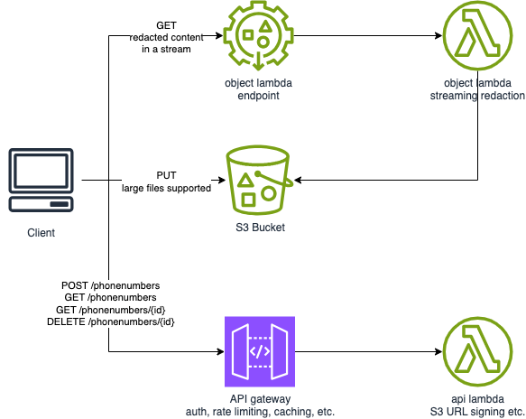

## TL;DR


Key Features:

* Efficient and compact design with minimal resource usage (CPU, storage), optimized for shortening lambda coldstart and improving performance. The only extra requirement is the `requests` library.
* Ensures the integrity of input data, maintaining the original content without any alterations. This feature facilitates multiple iterations over the development or business logic processes within the data pipeline.
* Support for processing large files:
  1. Uploads initiated through a presigned S3 URL to ensure security and efficiency.
  2. The solution employs an S3 Object Lambda for content filtering, implemented in a streaming approach to handle data efficiently.
  3. Enables the retrieval of processed content directly from the Object Lambda endpoint, ensuring a streamlined and secure download process.
* Infrastructure as code (IaC) with CDK for Terraform managing the AWS resources (shared with a S3 backend for state management)

## Overall Architecture



## Development

### Tooling

The following assumes that `cdktf`, `terraform`, `pipenv` and of `course python>=3.12` already installed.

See the following links for further information about how to install those

* https://developer.hashicorp.com/terraform/tutorials/cdktf/cdktf-install
* https://github.com/tfutils/tfenv
* https://github.com/pyenv/pyenv

The smoke test uses jq as well

* https://jqlang.github.io/jq/download/

In addition, CDKTF will require an AWS authenticated shell (either through user credentials or SSO with the AWS IAM identity center).

The `boto3` and `botocore` packages are part of the lambda runtime and not listed as project dependencies.

### Tests

#### Unit Tests

```bash
    pipenv run pytest
```

#### Smoke Test

Note: the BASE_URL is already set in the file.

```bash
    ./smoke-test.sh
```

#### Deployment

```bash
    ./test-and-deploy.sh
```

## CI/CD

I did not implement deployment on GitHub via GitHub actions, but it would follow the same logic as described above.

Will have to use a cdktf GitHub action etc. See:

* https://docs.github.com/en/actions/automating-builds-and-tests/building-and-testing-python
* https://github.com/hashicorp/terraform-cdk-action
